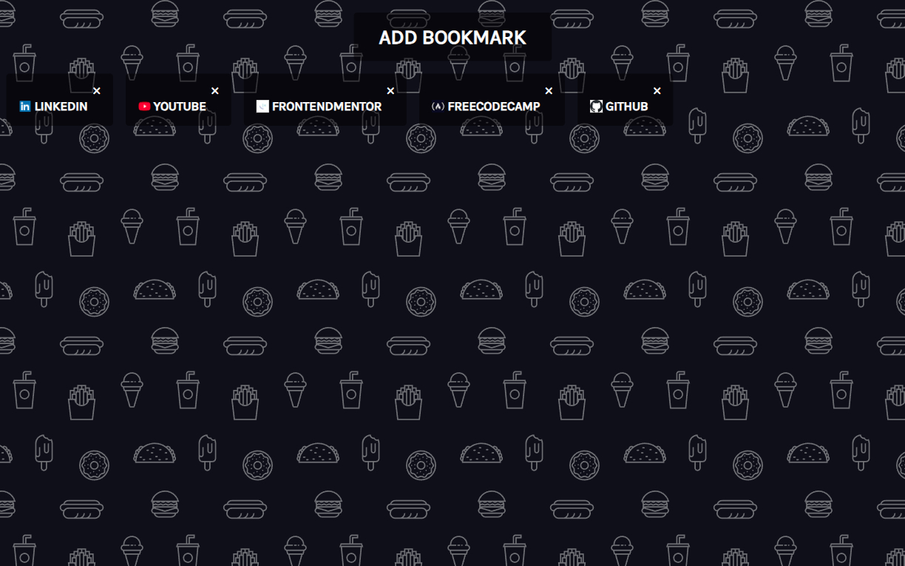

# Book Keeper | ZTM JS Web Projects Course

**Project 10/20**

📚 Book Keeper App is a simple and stylish web application that allows users to save, view, and delete their favorite websites. Featuring a custom modal form, favicon previews, and persistent storage using localStorage, it's a great project to practice full DOM control and UI feedback. Built as part of the ZTM JavaScript Web Projects Course.

---

## 📚 Table of Contents

- [🔎 Overview](#-overview)
  - [📸 Screenshot](#-screenshot)
  - [🔗 Links](#-links)
  - [📌 Features](#-features)
- [🧠 My process](#-my-process)
  - [🛠️ Built with](#️-built-with)
  - [🎓 What I learned](#-what-i-learned)
  - [🔙 Previous Project](#-previous-project)
  - [🔜 Next Project](#-next-project)
  - [🗃️ Useful resources](#️-useful-resources)
- [👤 Author](#-author)
  - [🌐 Connect with Me](#-connect-with-me)
  - [💻 Coding Profiles](#-coding-profiles)

---

## 🔎 Overview

### 📸 Screenshot

### 🔗 Links

 - [🔴 Live Demo](https://dalascript.github.io/book-keeper/)
 - [🗂️ GitHub Repository](https://github.com/DalaScript/book-keeper)

### 📌 Features

 - ✅ Add custom bookmarks with name and URL
 - ✅ Input validation using regular expressions
 - ✅ Auto-corrects missing "https://" in URLs
 - ✅ Clean modal popup with focus input behavior
 - ✅ Bookmark entries display with favicon and link
 - ✅ One-click deletion for saved bookmarks
 - ✅ Stores bookmarks in `localStorage` for persistence
 - ✅ Responsive design with mobile support

---

## 🧠 My Process

### 🛠️ Built with

 - HTML5
 - CSS3
 - Vanilla JavaScript

### 🎓 What I Learned

 - How to create and manage modals using CSS and JavaScript
 - Form validation with regular expressions and user-friendly alerts
 - Handling user input and auto-formatting URLs
 - Working with `localStorage` to save and load data persistently
 - Dynamically building and removing DOM elements
 - Designing clean, reusable, and responsive UI components
 - Using favicons dynamically via Google’s favicon API

  > 🚀 For me, this project was more about **practice** and gaining additional **experience**,  
  > rather than learning something entirely new.  
  >  
  > 👨‍💻 Since I’m not a beginner and already familiar with these technologies,  
  > I approached it with confidence — and still, I truly **enjoyed working on it**.  
  >  
  > 🎯 Overall, I consider this a very **valuable and enjoyable experience**.

### 🔙 Previous Project

 - Custom Countdown | *[Project 9/20]* → [View Repository](https://github.com/DalaScript/custom-countdown)

### 🔜 Next Project

  - Video Player | *[Project 11/20]* → [View Repository](https://github.com/DalaScript/video-player)

### 🗃️ Useful resources

 - [Hero Patterns](https://heropatterns.com/) – SVG background patterns for clean UI design
 - [FontAwesome Icons](https://fontawesome.com/icons?d=gallery&q=close&m=free) – Free icon library for UI elements
 - [Google Fonts](https://fonts.google.com/) – Free web fonts for better typography
 - [RegEx Playground Tool](https://regexr.com/) – Test and learn regular expressions
 - [W3Schools - Vertical Align Objects](https://www.w3schools.com/cssref/pr_pos_vertical-align.php) – Align inline elements vertically
 - [W3Schools - Prevent Default](https://www.w3schools.com/jsref/event_preventdefault.asp) – Prevent default form or link actions
 - [MDN - Label](https://developer.mozilla.org/en-US/docs/Web/HTML/Reference/Elements/label) – Label element for form accessibility
 - [MDN - Ternary Operator](https://developer.mozilla.org/en-US/docs/Web/JavaScript/Reference/Operators/Conditional_operator) – Short conditional expression syntax
 - [MDN - Submit Event](https://developer.mozilla.org/en-US/docs/Web/API/HTMLFormElement/submit_event) – Handle form submissions via JS
 - [MDN - Regular Expressions](https://developer.mozilla.org/en-US/docs/Web/JavaScript/Guide/Regular_expressions) – RegEx basics and examples
 - [MDN - localStorage](https://developer.mozilla.org/en-US/docs/Web/API/Window/localStorage) – Store key/value data in browser
 - [MDN - JSON Stringify](https://developer.mozilla.org/en-US/docs/Web/JavaScript/Reference/Global_Objects/JSON/stringify) – Convert JS to JSON string
 - [MDN - JSON Parse](https://developer.mozilla.org/en-US/docs/Web/JavaScript/Reference/Global_Objects/JSON/parse) – Parse JSON to JS object
 - [MDN - Array Splice](https://developer.mozilla.org/en-US/docs/Web/JavaScript/Reference/Global_Objects/Array/splice) – Add or remove array items

---

## 👤 Author

### 🌐 Connect with Me

 - [Instagram](https://www.instagram.com/DalaScript)
 - [YouTube](https://www.youtube.com/@DalaScript)

### 💻 Coding Profiles

 - [freeCodeCamp](https://www.freecodecamp.org/DalaScript)
 - [FrontendMentor](https://www.frontendmentor.io/profile/DalaScript)
 - [GitHub](https://github.com/DalaScript)

*🙌 Thanks for checking out my project! More coming soon. Stay tuned 🚀*
